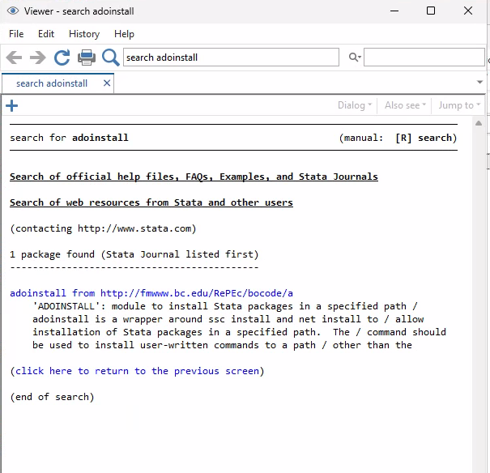
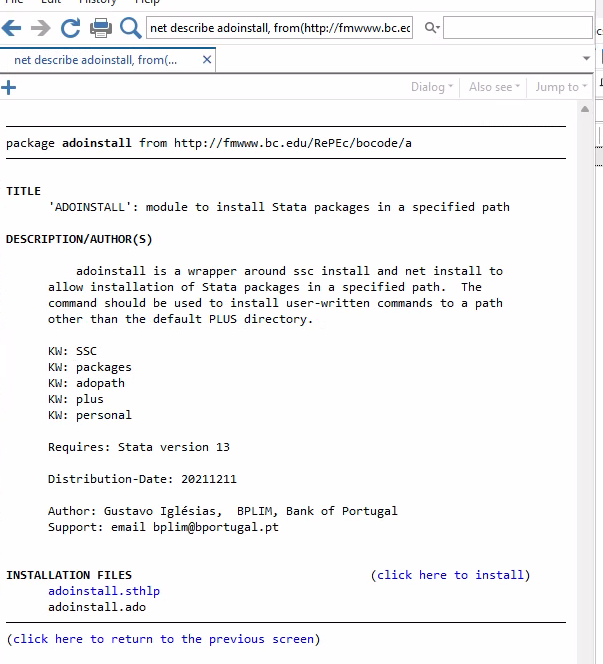
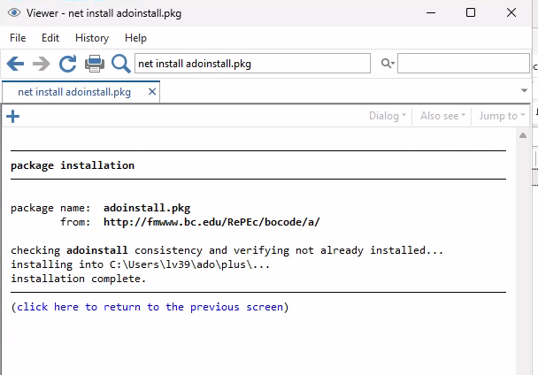
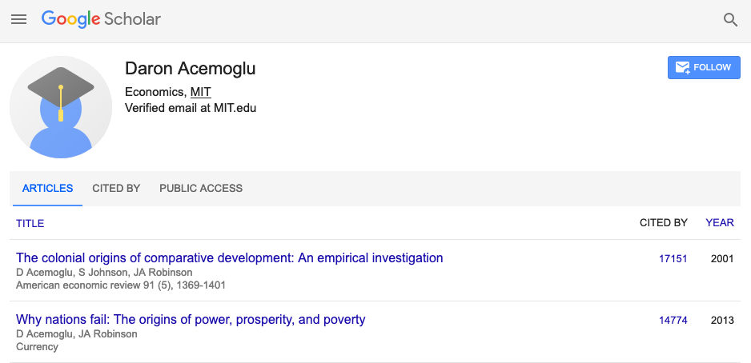

  
```{r, child=c('toc.md')}
```

## Overview

::: {.columns-2}

:::: {.column}

- Stata packages need to be installed

::::
  
:::: {.column}

- There are many ways to install them!
- Only a few lead to reproducible code!

::::
  
:::

# Installing Stata packages

## From the GUI

- Many people point and click - first search



## Then see the result



## Then click to install



## From the command line

```
search adoinstall
ssc install adoinstall
```

## From the command line

```
net install st_0034, from("http://statajournal.com/sj/1/2")
```

# But where does it go?

Do you know?

## It goes here

```
. adopath
  [1]  (BASE)      "/usr/local/stata17/ado/base/"
  [2]  (SITE)      "/usr/local/ado/"
  [3]              "."
  [4]  (PERSONAL)  "~/ado/personal/"
  [5]  (PLUS)      "~/ado/plus/"
  [6]  (OLDPLACE)  "~/ado/"

```

## Or here

```
. adopath
  [1]  (BASE)      "C:\Program Files\Stata17\ado\base/"
  [2]  (SITE)      "C:\Program Files\Stata17\ado\site/"
  [3]              "."
  [4]  (PERSONAL)  "C:\Users\lv39\ado\personal/"
  [5]  (PLUS)      "C:\Users\lv39\ado\plus/"
  [6]  (OLDPLACE)  "c:\ado/"

```

## Where DID it go?

```
. which adoinstall
C:\Users\lv39\ado\plus\a\adoinstall.ado
*! version 0.1 5Aug2020
```

## What are the problems?

- Single place on disk where it is installed
  - Can you see the problem if you have multiple projects?
- The place where it is installed is not related to the project
  - How do I convey to replicators which package is needed?
  - ... and the version of the package
- The point-and-click or manual install are tedious
  

# Solution

Use **code** to install to a **project-specific location**.

## Solution

```
cd "$rootdir"
// Remove those unnecessary places
adopath - OLDPLACE
adopath - PERSONAL
// Add a project specific one, by repurposing the PLUS directory
cap mkdir "${rootdir}/adofiles"
sysdir set PLUS "${rootdir}/adofiles"
```

## Outcome

(note the search order)

```
. adopath ++ "${rootdir}/adofiles"
  [1]  (PLUS)      "/path/to/project/adofiles"
  [2]  (BASE)      "C:\Program Files\Stata17\ado\base/"
  [3]  (SITE)      "C:\Program Files\Stata17\ado\site/"
  [4]              "."
```

## Side-note: should you cite Stata packages?

Some of the most common Stata packages are heavily used:

```
. ssc, hot

 Rank   # hits    Package       Author(s)
  ----------------------------------------------------------------------
     1  98781.5    outreg2       Roy Wada                                
     2  82108.0    distinct      Gary Longton, Nicholas J. Cox           
     3  76510.6    estout        Ben Jann                                
     4  75270.7    geodist       Robert Picard                           
     5  73775.4    labutil       Nicholas J. Cox                    
```

## Econ papers use different packages

| Package | Percent | 
|---------|---------|
|    estout        |  14.02  |
|   outreg2        |   8.88  |
|   reghdfe        |   6.54  |
|    ftools        |   5.61  |
|  coefplot        |   5.14  |
|  outtable        |   2.34  |
|   parmest        |   2.34  |
|    ivreg2        |   1.87  |

## What is a software citation?

> Ben Jann, 2004. "ESTOUT: Stata module to make regression tables," Statistical Software Components S439301, Boston College Department of Economics, revised 12 Feb 2023. 


## Why does it matter?

Citations are the currency in the sciences



## We cannot really measure who relies on software packages

We only know the relative frequency because 

- we downloaded every AEA package, 
- ran it, 
- determined which packages were missing, installed them, and ran again...
- and then counted them. 

# You should cite software packages!

We will get back to citations, of data, later.

## Next

How do we set `$rootdir` ?

## Next


```{r, child=c('toc.md')}
```
