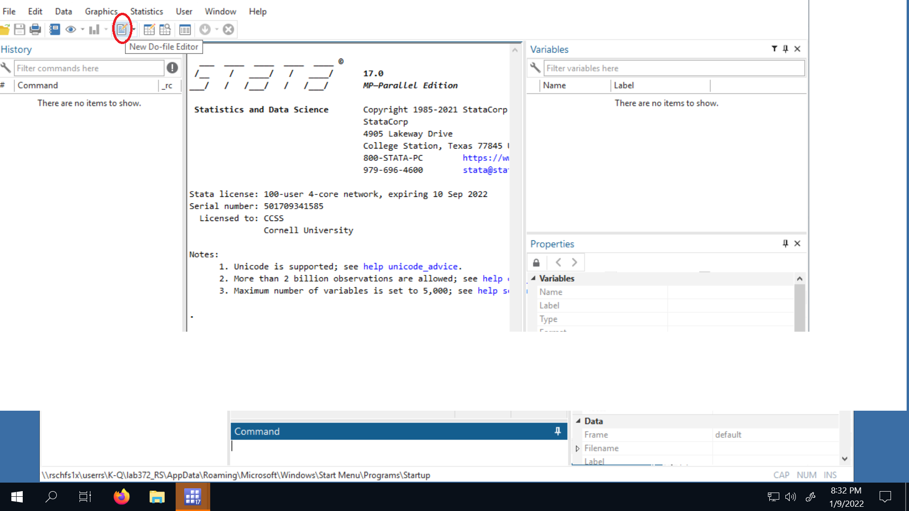
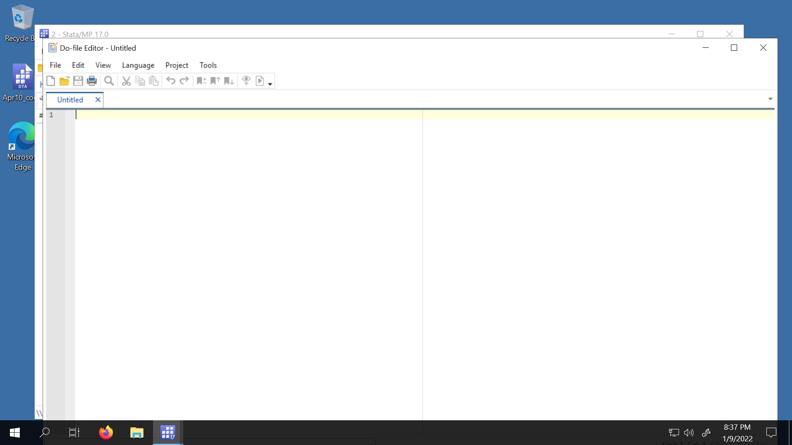
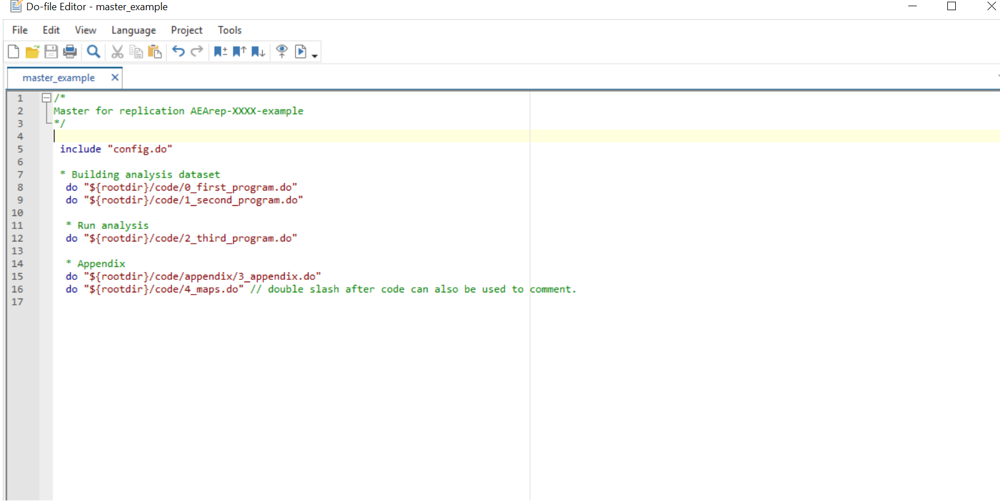
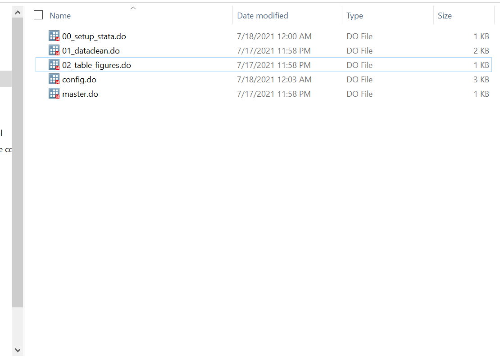
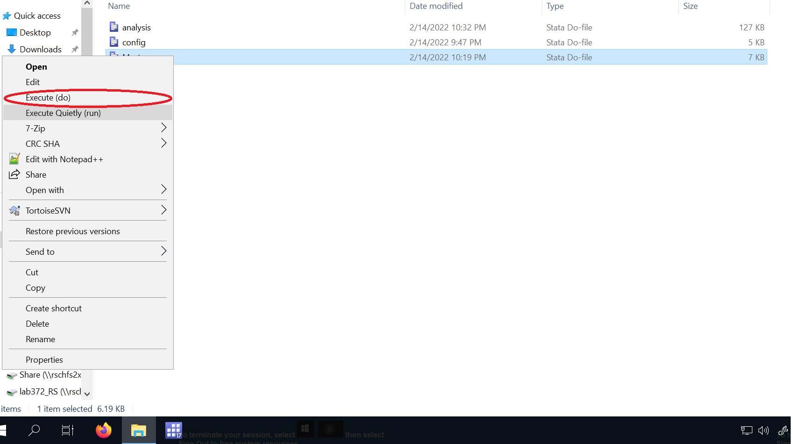

# Running Code in Stata

## How do YOU run a Stata program?

```{r, child=c('counter10.md')}
```

Goals

 1. Making sure that paths (i.e., something like "`Mycomputer/Documents/Workspace/`") in the .do files (Stata scripts) reflect the appropriate location of code, data, and output in the computer where the code is run.
 2. Installing user-written functions, programs, or packages that are necessary to do computations and produce tables/figures.
 3. Creating .log files (files that record, in this case, Stata output) of the replication attempts.

## Step 1: check for a "master" .do file

> **[ACTION]** Check the README or the repository and determine if a master .do file was provided.

A master .do file is a Stata script that will call, in the correct sequence, all the programs necessary to construct analysis datasets, do all computations, and produce figures and tables. If a master do file exists, it should be mentioned in the README. In most cases, running a single master do file is sufficient to complete the reproduction. In general, a master script does not need to be a .do file. However, we will focus on cases where all work done in Stata is reduced to executing a single .do file.


### When a master .do file is provided

If there is a master do file, continue with [Step 2](Step2).

(create-master)=
### When a master .do file is not provided

If a master .do file is not provided, you should create a one. 

To create a do file follow the following steps:

1. Check that the README for specific instructions about the order in which each program is supposed to be run. If there are no such instructions, or they are not obvious by the name of the programs, is probably best to not create a master do file.

2. Assuming that the sequence of programs is clear to you, open stata and click on the "New do file editor" (you can also work on Visual Studio Code):



To open the do file editor:



3. In the first line write `include "config.do"`

4. Write the command `do` and the (quoted) path of each program that needs to be run. Write them in the correct sequence. 

Example:

```
include "config.do"
 
* Assuming scenario "A"

do "${rootdir}/code/0_first_program.do" 
do "${rootdir}/code/1_second_program.do"
do "${rootdir}/code/2_third_program.do"
do "${rootdir}/code/appendix_code/appendix.do"

```

5. Save your master file.

At the end your master .do file may look like this:



With your master do file done, continue with [Step 2](Step2).

(Step2)=
## Step 2: place config.do where the master .do file is located 

> **[ACTION]** Copy the file [`template-config.do`](https://github.com/AEADataEditor/replication-template/blob/master/template-config.do) and paste it into the folder where the master file is located. Change the name from `template-config.do` to `config.do`

The folder with the code, whether is the root directory or a subfolder, should look something like this:



## Step 3: include config.do in the master .do file

> **[ACTION]** Open the master .do file. In the beginning, add the line:

```
1 include "config.do"
2
3 /* This is Master do file */
```

> Save.

More information about `config.do` can be found in "[Using Config.do](using-config-do)".
.

In summary, `config.do` does 4 things:

- Creates a global variable called "rootdir" with the local path to the root directory.
- Creates a logs files.
- Sets a path to save the packages to be installed in the replication repository, and
- It allows you to install the packages simply by listing their names.

A crucial function of `config.do` is that it allows for the local installation of Stata packages, which is important for two reasons. First, it will enable us to check for the completeness of replication materials. Second, when running code in servers, we often do not have the necessary permissions to install Stata packages freely.`config.do` allow us to installed packages in the replication directory.  

## Step 4: modifying paths if necessary

> **[ACTION]**
>
> - Check the Readme and determine if (and where) the root directory should be modified.
> - Open the .do file to be modified (probably the master .do file) and set the global variable `$rootdir` as the path.
> - Save.

To run the code, we need to make sure that Stata can access the locally-saved data, access the packages that will be installed, and save the output in the computer where you are running the code. To do that, we often need to change some directory paths defined in the .do files provided. This step may vary in each replication package, so you need to look at the README instructions closely. Some packages may not require any change, while others may require a little more work.

However, the typical case will only require one modification, either to the master .do file or to a program called by the master .do file, where you define the path of the location of the replication package. This location is what we refer to as the "root directory". Once this change is made, the code provided (if it follows good practices) will define every other path relative to the root directory.

### Example

In the author's master file, a global variable "maindir" defines the path of the root directory as:

```
/* This is Master do file */

global maindir "C:\Users\Author\Dropbox\Project1" // this is the path to the repository
global data "$maindir/data" // path to data folder
global figures "$maindir/figures" // path to figures folder
```

You would add `config.do` and change the global.
After the change:

```
include "config.do"

/* This is Master do file */

global maindir "$rootdir" // this is the path to the repository
global data "$maindir/data" // path to data folder
global figures "$maindir/figures" // path to figures folder
```

## Step 5: Check the location of the master .do file and modify config.do

> **[ACTION]**
>
> - If the master .do file is directly placed in the root directory, set the parameter `scenario` to be `B` and save. 
> - If the master .do file is inside a folder, open `config.do` and set the parameter `scenario` to `A` and save. (This is the default, so really no action is necessary.)
> - If the replication package includes a folder with Stata packages, add the line  `adopath ++` followed by the path of the location of that folder and save. See [Appendix F](https://labordynamicsinstitute.github.io/replicability-training-curriculum/using-config-do-in-stata.html) for details.
> - Add packages that need to be installed to config.do. See [Appendix F](https://labordynamicsinstitute.github.io/replicability-training-curriculum/using-config-do-in-stata.html) for details.

### Scenario A

A simplified directory structure that correspond with scenario "A" look like this:
```
 directory/
              code/
                 main.do
                 01_dosomething.do
              data/
                 data.dta
                 otherdata.dta

```

#### Example

- A Master .do file is  inside a folder and you have placed `config.do` in that same folder. The package `estout` needs to be installed:

```
* Template config.do */

local scenario "A" 
* *** Add required packages from SSC to this list ***
local ssc_packages "estout ivreg2"
    // Example:
    // local ssc_packages "estout boottest"
    // If you need to "net install" packages, go to the very end of this program, and add them there.
```

### Scenario B

A simplified directory structure that correspond to scenario "B" looks like this:

```
 directory/
        main.do
        scripts/
             01_dosomething.do
        data/
             data.dta
             otherdata.dta
```


### Scenario C

Sometimes, we encounter Scenario C, which adds an additional level. A simplified directory structure that correspond to scenario "C" looks like this:

```
directory/
	    step1/
            scripts/
                main.do
                01_dosomething.do
        step2/
	        scripts/
	            othermain.do
		        01_analysis.do
        data/
            data.dta
            otherdata.dta
```

Note: you would place the `config.do` in **all** directories that have some sort of `main.do`. 

#### Example


- A Master .do file is in the main directory, and you have placed `config.do` in the main directory. The package `estout` and `ivreg2` need to be installed:


```
/* Template config.do */

local scenario "B"  // around line 30
*** Add required packages from SSC to this list ***
local ssc_packages "estout ivreg2"
    // Example:
    // local ssc_packages "estout boottest"
    // If you need to "net install" packages, go to the very end of this program, and add them there.
```

## Step 6: Run the Code


::::{tab-set}

:::{tab-item}  Windows 

> **[ACTION]** **Right click** on the master .do file and select the option `Execute (do)`.



This option will set the working directory  to the location where the `master.do` is. It opens Stata and will show the processes in the Stata window.


:::

:::{tab-item} Mac/Linux 

On Unix-style systems, the preferred way is to use the command line to run Stata code.

> Mac-specific one-time setup: Open Stata on your Mac, go to the "Stata" tab at the top of your screen and click "`Install Terminal Utility…`" 

Open up a terminal in the folder where the `master.do` file is located - this may differ depending on your system, and may involve using "`cd /path/to/code`" commands. Confirm with "`ls`" that you see the same files you might see in Finder / File Explorer. Refer to the command line training in the initial training.

Identify which Stata version you have installed (some systems have only one, some have multiple):

```
which stata
which stata-se
which stata-mp
```

Each version is increasingly powerful. Choose the most powerful one installed on your system. (We will assume that you have `stata-mp` but adjust accordingly)

Then  type "`stata-mp -b do master.do`". 


::: 

::::

### Checking for a complete run, debugging and running the master in pieces

After running the code, the log files will need to be checked for a complete run. **Use Visual Studio Code to open and inspect log files**. Any bugs that prevents a complete run will also show up in the log files.

If a you find a bug that is simple enough to fix, you can make changes to the do files. Then,  you can right click on the master file and select `Execute (do)` as this option will open Stata, allowing to run the code interactively.

If you decide the code needs to be run in pieces (this is NOT ideal)

- In the master .do file, you can comment out (using the symbol \*) the programs that are not to be run and save the master. 
- Then, you can right click on the master and select the option ``Execute (do)`.

When debugging is complete, you can uncomment all programs in the master and make a clean run, using again `Execute Quietly (run)`.

> Consider how much time a complete run would take before you run everything one last time. If it would take too long, you may want to skip a complete run, but ensure that you have log files for all partial runs. Make a note of this in the report.
