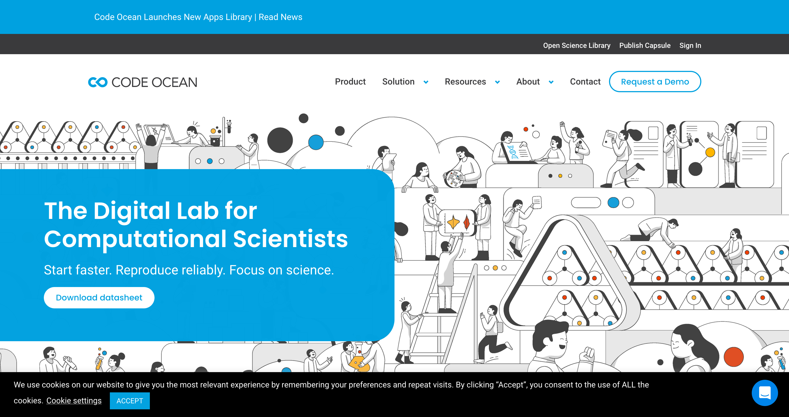
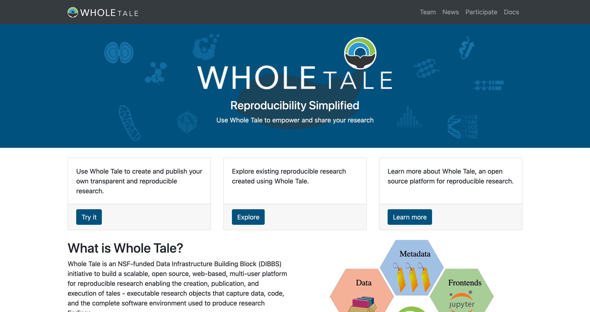

  
```{r, child=c('toc.md')}
```

# How to run things in the cloud

# What IS the cloud??

## What is the cloud?

> Cloud computing is the on-demand delivery of IT resources over the Internet with pay-as-you-go pricing. Instead of buying, owning, and maintaining physical data centers and servers, you can access technology services, such as computing power, storage, and databases, on an as-needed basis from a cloud provider.

## Cloud providers

Big ones:

- Amazon Web Services (AWS) - about 30% market share
- Azure (Microsoft)
- Google Compute Platform (GCP)

Many smaller ones.

> How big?

Nobody (except - maybe - the companies themselves) knows. A 2014 estimate for AWS was 1.4 million servers, and it and its competitors have only grown since then.

## Cloud and you

Is it easy to use the cloud? Absolutely not (unless you are Certified AWS/Azure/etc. Professional (TM))

Exceptions: Some academic clouds (funded in the US by NSF, Canada: Compute Canada) 

## So how does it help me?

Many secondary services have sprung up to enable easy use. Here are just a few for the academic sector (many more in the private sector)

- Codeocean.com (CO)
- Google Colab
- Wholetale.org (WT)
- Github Codespace or Actions

Often a datascience-centric interface, but CO and WT enable native Stata functionality!

## Python in the cloud

- Github  Codespaces [https://github.com/codespaces](https://github.com/codespaces)
- Google Colab [https://research.google.com/colaboratory/](https://research.google.com/colaboratory/)
- CodeOcean [https://codeocean.com/](https://codeocean.com/)
- Wholetale [https://wholetale.org/](https://wholetale.org/)

## R in the cloud

- Rstudio/Posit Cloud [https://posit.cloud/](https://posit.cloud/)
- CodeOcean [https://codeocean.com/](https://codeocean.com/)
- Wholetale [https://wholetale.org/](https://wholetale.org/)

## Stata in the cloud

- CodeOcean [https://codeocean.com/](https://codeocean.com/)
- Wholetale [https://wholetale.org/](https://wholetale.org/)

## A tool for cloud-centric computing

Many cloud-centric tools are based on Docker containers. 

We won't go into those today, but we will leverage one. 

## Demo: CodeOcean

[](https://codeocean.com/)

## Demo: WholeTale

[](https://wholetale.org/)

## Demo: Github Codespaces with R and Stata

[Github Codespaces](https://github.com/codespaces)

## Let's give it a try

```{r, child=c('counter30.md')}
```
