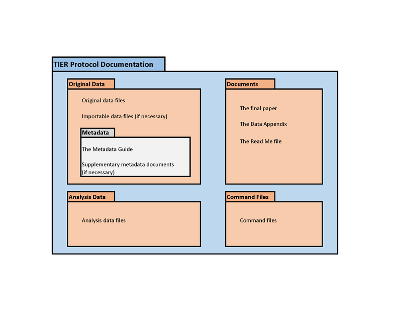

```{r, child=c('toc.md')}
```

## Overview

::: {.columns-2}

:::: {.column}


- **Reproducible practices**

::::

:::: {.column}

- Ideal directory and data structure
- Some programming practices


::::

:::

# Part 1 | Ideal structure

## Generic project setup




[TIER Protocol](https://www.projecttier.org/tier-protocol/specifications-3-0/)

## Basic project setup

::: {.columns-2}

:::: {.column}

**Structure your project**

- Data inputs
- Data outputs
- Code
- Paper/text/etc.

::::

:::: {.column}

**Version your project (`git`)!**

**Track metadata**

- cite articles you reference
- *cite* data sources you use
  - We will get back to data citations later!

::::

:::

## Project setup examples


::: {.columns-2}

:::: {.column}

```
/inputs
/outputs
/code
/paper
```

:::: 

:::: {.column}

```
/datos/
    /brutos
    /limpiados
    /finales
/codigo
/articulo
```

::::

:::

It doesn't really matter, as long as it is logical. We will get to how this translates to confidential or big data in a moment!

# Computational Empathy

## Consider how the next person will (be able to) compute

- You don't know who that is
- You don’t know what they don’t know
- Will not have any of your add-on packages/ libraries/ etc. pre-installed
- Don’t force them to do tedious things

**It might be "Future You!"**

## It *IS* you

The replicator is the first (?) reader of the instructions who will need to reproduce the analysis.

## Streamlining

- Master script preferred
  - Least amount of manual effort
- No manual copying of results 
  - (dynamic documents!)
  - Write out/save tables and figures using packages
- Clear instructions
- No manual install of packages
  - Use a script to create all directories, install all necessary packages/requirements/etc.

## Reproducibility

- No manual manipulation 
  - “Change the parameter to 0.2, then run the code again”
  - Use *functions*, ado files, programs, macros, subroutines
  - Use *loops*, parameters, *parameter files* to call those subroutines
  - Use *placeholders* (globals, macros, libnames, etc.) for common locations ($CONFDATA, $TABLES, $CODE)
- Compute all numbers in package
  - No manual calculation of numbers
- Use cross-platform programming practices

## Cross-platform programming practices 1

**Use programming-language specific code as much as possible**

Avoid
```{r, eval=FALSE}
system("unzip C:\data\myfile.zip")
```
or
```{stata, eval=FALSE}
shell unzip "C:\data\myfile.zip"
```


## Cross-platform programming practices 1

Most languages have appropriate code:

R:

```{r, eval=FALSE}
unzip(zipfile, files = NULL, list = FALSE, overwrite = TRUE,
      junkpaths = FALSE, exdir = ".", unzip = "internal",
      setTimes = FALSE)
```

Stata:

```{stata, eval=FALSE}
unzipfile "zipfile.zip" [, replace]
```


## Cross-platform programming practices 2

Use neutral pathnames (mostly forward slashes)

::: {.columns-2}


:::: {.column}

**R**: Use functions to combine paths (and/or use forward slashes), packages to make code more portable.

<div class="red2">
```
basepath <- rprojroot::find_root(rprojroot::has_file("README.md"))
data <- read.dta(file.path(basepath,"path","data.dta"))
```
</div>
::::

:::: {.column}

**Stata**: *always* use forward slashes, even on Windows

<div class="blue2">

```
global data "/my/computer"
use "$data/path/data.dta"
```
</div>

::::

:::


# More complex Data structures

## Back to the TIER protocol


## Generic suggested data structure


## When data are big/in the cloud


## When data are confidential


## When data are confidential


## Project setup examples


::: {.columns-2}

:::: {.column}

This may no longer work:

```
/data/
    /raw
    /clean
    /final
/code
/article
```

::::


:::: {.column}

But this might

```
/project123/
     /data/
        /raw
        /clean
        /final
     /code
     /article
/confidential        (read-only)
     /taxes          (read-only)
     /wages          (read-only)
```

:::: 

:::


## Stata configuration files {.smaller}

File structure thus becomes more complex, but fundamentally not so different:

```{stata, eval=FALSE}
global taxdata    "/confidential/taxes"  
global salarydata "/confidential/wages"  
global outputdata "/project/data/clean" // this is where you would write the data you create in this project
global results    "/project/article"    // All tables for inclusion in your paper go here
global programs   "/project/code"       // All programs (which you might "include") are to be found here
```


## Stata configuration files {.smaller}

Or even more robust:

```{stata, eval=FALSE}
global basedir     "/project123"
global confbase    "/data/provided"
global project     "$basedir/project"

global taxdata    "$confbase/taxes"  
global salarydata "$confbase/wages"  
global outputdata "$project/data/clean" // this is where you would write the data you create in this project
global results    "$project/article"    // All tables for inclusion in your paper go here
global programs   "$project/code"       // All programs (which you might "include") are to be found here
```

# Try it out!

- Set up a directory structure
- Set up a simple project
- Share it with us!

# Tomorrow


```{r, child=c('toc2.md')}
```