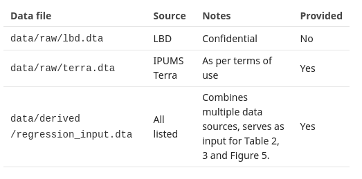

  
```{r, child=c('toc2.md')}
```

## Overview

::: {.columns-2}

:::: {.column}

Part 1:
  
- Reproducible practices
- **The role of the template README**

::::
  
:::: {.column}

- Summarizes the data sources
- Summarizes necessary resources
- Summarizes reproduction procedures


::::
  
:::

# Template README

## Published in December 2020 {.smaller}

```{r readmeweb,echo=FALSE}

knitr::include_url("https://social-science-data-editors.github.io/template_README/")

```

## Overview

```{r readmeweb2,echo=FALSE}

knitr::include_url("https://social-science-data-editors.github.io/template_README/#description")

```


## Overview

**guides a reader through the available material and a route to replicating the results in the research paper**, including 

- the description of the origins of data and/or description of programs. 
- provides a brief overview of the available material and 
- provides a brief guide as to how to proceed from beginning to end
- then dives into the specifics.


## Data and Code Availability Statement (DCAS)

```{r readmeweb3,echo=FALSE}

knitr::include_url("https://social-science-data-editors.github.io/template_README/#data-and-code-availability-statement")

```


## Data and Code Availability Statement (DCAS) {.build}

It contains information about the **sources of data used in the replication package**, in addition to or instead of such detailed description in the manuscript. 

- Not just a data citation
- describes additional information necessary for the obtention of the data. 

These may include 

- required registrations, 
- memberships, 
- application procedures, 
- monetary cost, or 
- other qualifications.


## Computational Requirements

```{r readmeweb4,echo=FALSE}

knitr::include_url("https://social-science-data-editors.github.io/template_README/#computational-requirements")

```


## Computational Requirements {.build}

For simple replication packages, may appear to be trivial (a laptop and some common software)

What if requirement is **expensive commercial software** and **a super computer cluster**?


## Computational Requirements

In order to assess the complexity of the task of replicating, authors should specify each of the following elements:

-  **Software** used, including version number as used. If the code is expected to run with a lower version number, that should be added.
- Any additional **packages**, including their version number or similar, as used.
-   The **computer hardware specification** as used by the author, in terms of OS, CPU generation and quantity, memory and necessary disk space. If multiple computers were used, the specification for each should be identified.
-  The **wall-clock time** given the provided computer hardware, expressed in appropriate units (minutes, days).

# Details of the README

## Expectations

The README is strongly suggested, but sometimes ignored. 

You should nevertheless treat all replication packages as if they should have had the same information, easily accessible.

## More details {.smaller}


```{r readmeweb5,echo=FALSE}

knitr::include_url("https://social-science-data-editors.github.io/template_README/template-README.html#data-availability-and-provenance-statements")

```
## More details {.flexbox .vcenter}

Important: **The information should describe ALL data used, regardless of whether they are provided as part of the replication archive or not, and regardless of size or scope.**

For instance, if using GDP deflators, the source of the deflators (e.g. at the national statistical office) should also be listed here.

## Rights and licenses


```{r readmeweb6,echo=FALSE}

knitr::include_url("https://social-science-data-editors.github.io/template_README/template-README.html#statement-about-rights")
```

## Rights and licenses

- can we OBTAIN data when authors say we cannot
- journals may check if authors are ALLOWED to provide the data when the data are included
- can we obtain data as per instructions by the authors
  
## Availability of data


```{r readmeweb7,echo=FALSE}

knitr::include_url("https://social-science-data-editors.github.io/template_README/template-README.html#summary-of-availability")
```

## Listing of data sets

Data sources translate into datasets. Ideally, the README lists them:



## Computational requirements

What do you need to run the analysis?

- Computers
- Software
- Time

## Computational requirements


```{r readmeweb8,echo=FALSE}

knitr::include_url("https://social-science-data-editors.github.io/template_README/template-README.html#computational-requirements")

```

## Computational requirements 

You will need to figure out if you can do it 

- Can you run on your laptop?
- Do we need more resources?

> Portions of the code were last run on a 12-node AWS R3 cluster, consuming 20,000 core-hours.

## The code


```{r readmeweb9,echo=FALSE}

knitr::include_url("https://social-science-data-editors.github.io/template_README/template-README.html#description-of-programscode")

```

## The code

This should provide some details, but ideally:

- explain summarily what the code does
- might explain in detail what the code does

## Instructions


```{r readmewebA,echo=FALSE}

knitr::include_url("https://social-science-data-editors.github.io/template_README/template-README.html#instructions-to-replicators")
```

# Warning

## Warning

In many of the READMEs you will see, not everything is as clear as what we just outlined.

# Next

```{r, child=c('toc2.md')}
```
