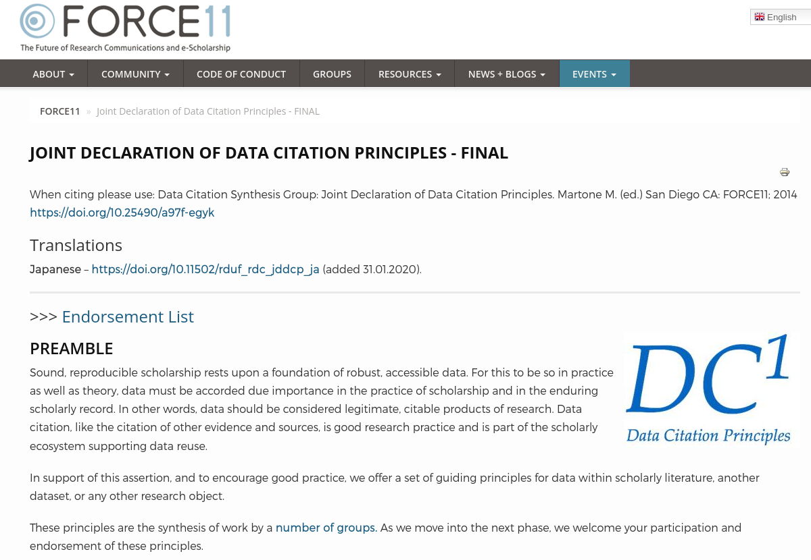
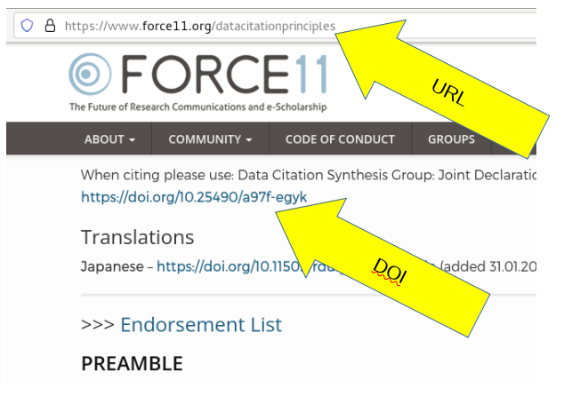

  
```{r, child=c('toc2.md')}
```

# Data citations

## Data citations

One of the most vexing issues is how to cite data. Many researchers have not been trained, and don't get it right.

## What is not a data citation

Many authors initially neglect to add data citations, or do not know how to add a data citation. Often, we see authors cite papers with supplementary data, but not databases or other data:

> We use data acquired from the NHL, dates of power outages collected by Tremblay et al (2018), augmented with information on the language and grammar skills of hockey players provided by the Ethnologue database.


(note absence of citation for NHL and Ethnologue data). In the above example, three datasets are used, but only one is cited in some fashion.

## Better data citation {.smaller}

> We use data acquired from the NHL (NHL, 2018), dates of power outages collected by Tremblay et al (2018, 2019), augmented with information on the language and grammar skills of hockey players provided by the Ethnologue database (Eberhard et al, 2019).

with the reference list having the following entries:

* Eberhard, David M., Gary F. Simons, and Charles D. Fennig (eds.). 2019. *Ethnologue: Languages of the World.* Twenty-second edition. Dallas, Texas: SIL International. Online version: http://www.ethnologue.com.
* National Hockey League. 2018. *NHL Game Database 1917-2018*. National Hockey League Hall of Fame, Toronto, ON. Accessed February 29, 2019.
* Tremblay, Réjean, Ken Dryden, and José Theodore. 2018. "The impact of power outages on goal-keeping in the NHL", *Journal of National Hockey Leagues*, vol 32, iss. 1. 
* Tremblay, Réjean, Ken Dryden, and José Theodore. 2019. "Power outages during NHL games (updated)", *Canadian Hockey Dataverse*, doi:10.1234/nhl.lnh.haha 

## Why data citations



## Why data citations

The [Data Citation Principles](https://doi.org/10.25490/a97f-egyk) note that (emphasis added):

> Sound, reproducible scholarship rests upon a foundation of robust, accessible data. For this to be so in practice as well as theory, data must be accorded due importance in the practice of scholarship and in the enduring scholarly record. In other words, data should be considered legitimate, **citable products of research**. Data citation, **like the citation of other evidence and sources**, is good research practice and is part of the scholarly ecosystem supporting data reuse.

## Data Citation Principles

- Data citation increases the findability, accessibility, interoperability, and re-usability of research data (known as [FAIR](https://www.go-fair.org/fair-principles/)). 
- Through data citations, data providers can link to articles ([sometimes automatically](https://www.crossref.org/services/event-data/)), allowing them to show the academic value of the data and continue providing the services around data creation.
- Data citations open a new path to finding relevant science, by reaching the linked articles through data search interfaces, like [openICPSR](https://www.openicpsr.org/openicpsr/search/aea/studies), [Data-Pass](http://www.data-pass.org/), and [Google Dataset Search](https://toolbox.google.com/datasetsearch).

# Citation guidance

## Generic Guidance (AEA)

The AEA follows the *Chicago Manual of Style (CMOS)*, with several [additions on the AEA website](https://www.aeaweb.org/journals/policies/sample-references). 

One of the criteria for a useful citation is conveying authority and permanence ([CMOS](https://www.chicagomanualofstyle.org/book/ed17/part3/ch14/psec014.html)):

> Electronic content presented without formal ties to a publisher or sponsoring body has the authority equivalent to that of unpublished or self-published material in other media.

## More than just attribution

[They also note](https://www.chicagomanualofstyle.org/book/ed17/part3/ch14/psec014.html) that 

> Authors should note that anything posted on the internet is “published” in the sense of copyright and must be treated as such for the purposes of complete citation and clearance of permissions, if relevant.

## Data Citation Guidance: Websites

When citing information from websites, including data downloaded from websites, use the general website citation style for data:

> Google. 2017. “Privacy Policy.” Privacy & Terms. Last modified April 17, 2017. https://www.google.com/policies/privacy/.

> Yale University. n.d. “About Yale: Yale Facts.” Accessed May 1, 2017. https://www.yale.edu/about-yale/yale-facts.

Note that this does NOT apply when the data have a permanent URL, a DOI, or a suggested citation!

## Data Citation Guidance: Github

### Github is a website

Many researchers now use [Github](https://github.com) to store code or documents. How should Github repositories (or for that matter, [Gitlab](https://gitlab.com) or [Bitbucket](https://bitbucket.org)) repositories be cited?

Any online repository can be deleted by its owner at any time, and in that sense, are no more or less robust than [websites], and the same rules apply:

> Vilhuber, Lars, Connolly, Marie, Koren, Miklós, Llull, Joan, & Morrow, Peter. (2020). "A template README for social science replication packages." *Github*. https://github.com/social-science-data-editors/template_README/. Accessed 2021-07-01.


## Data Citation Guidance: Github

### Github releases: better

However, online repositories do provide the ability to make **releases**, providing a better way to pin changes made over time. While this does not change the fundamental treatment as a website, it is a more robust reference:

> Vilhuber, Lars, Connolly, Marie, Koren, Miklós, Llull, Joan, & Morrow, Peter. (2020). "A template README for social science replication packages." Github. Release  v1.0.0). https://github.com/social-science-data-editors/template_README/releases/tag/v1.0.0. Accessed 2021-07-01.


## Data Citation Guidance: Github
### Github archived

However, Github is currently unique among online repositories in enabling an automatic integration with [Zenodo](https://zenodo.org) ([making code citable](https://guides.github.com/activities/citable-code/)) 

Zenodo-preserved versions are no longer subject to arbitrary deletion, get a DOI:


> Vilhuber, Lars, Connolly, Marie, Koren, Miklós, Llull, Joan, & Morrow, Peter. (2020). A template README for social science replication packages (Version v1.0.0). Zenodo. http://doi.org/10.5281/zenodo.4319999

Of note: while Github is unique in its automatic integration, any release of an online code repository can be manually preserved on Zenodo, then cited in the above fashion. 

# DOI?

## Digital Object Identifier

What is a Digital Object Idenfifier?



## Digital Object Identifier

- a DOI (e.g. **10.25490/a97f-egyk** or **https://doi.org/10.25490/a97f-egyk**) is a **permanent** identifier, and comes with a commitment by the issuer to preserve the *underlying object* and its *landing page*.

- it **redirects** to a URL, which is what your browser shows in the address bar.

- if a DOI is shown on the website, you should NEVER use the URL to refer to it.

- a DOI **never** shows in your address bar (except if it fails) (try [https://doi.org/10.25490/a97f-egyk-gobbledygook](https://doi.org/10.25490/a97f-egyk-gobbledygook))


## Failed DOI


```{r doifail,echo=FALSE}

knitr::include_url("https://doi.org/10.25490/a97f-egyk-gobbledygook")

```

## Data Citation Guidance: Online databases

[CMOS guidance  for online databases](https://www.chicagomanualofstyle.org/book/ed17/part3/ch14/psec257.html):

> NASA/IPAC Extragalactic Database (object name IRAS F00400+4059; accessed April 6, 2016). http://ned.ipac.caltech.edu/.

which would be cited in the text as `NASA/IPAC Extragalactic Database`.

## Data Citation Guidance:  Data distributed as supplementary data

The [CMOS provides examples](https://www.chicagomanualofstyle.org/book/ed17/part3/ch14/psec187.html) of how to cite supplementary materials that are attached to a specific article:

> Suárez-Rodríguez, M. and C. Macías Garcia. 2014. "There Is No Such a Thing as a Free Cigarette: Lining Nests with Discarded Butts Brings Short-Term Benefits, but Causes Toxic Damage." *Journal of Evolutionary Biology* 27, no. 12 (December 2014): 2719–26, https://doi.org/10.1111/jeb.12531, data deposited at Dryad Digital Repository, https://doi.org/10.5061/dryad.4t5rt.

## Data Citation Guidance:  Data supplement, AEA

> Romer, Christina D., and David H. Romer. 2010. "Replication data for: The Macroeconomic Effects of Tax Changes: Estimates Based on a New Measure of Fiscal Shocks." *American Economic Association [publisher]*, * Inter-university Consortium for Political and Social Research [distributor]*, https://doi.org/10.3886/E112357V1

with the article also cited as:

> Romer, Christina D., and David H. Romer. 2010. “The Macroeconomic Effects of Tax Changes: Estimates Based on a New Measure of Fiscal Shocks” *American Economic Review.* no. 3 (June 2010): 763–801. https://doi.org/10.1257/aer.100.3.763.

## Data Citation Guidance: Citation requests? {.smaller}

### Citing the paper or the data?

Several data distributors already request or require citation as per their terms of use, or as a note on their websites. Often, following traditional usage, they request citation of a published article, not of the data. For example, the widely used "Penn World Tables" request that the article that introduced this version of the Penn tables be cited:

> Feenstra, Robert C, Robert Inklaar, and Marcel P Timmer. 2015."The next generation of the Penn World Table." *American Economic Review*, 105(10): 3150-82.

For accurate citations as well as compliance with data citation principles, **in addition** to citing the Feenstra et al (2015) article as requested by the data provider, authors should **also** correctly cite the data:

> Robert C. Feenstra, Robert Inklaar and Marcel P. Timmer. 2016. “Penn World Table 9.0.” *Groningen Growth and Development Centre*. [https://doi.org/10.15141/S5J01T](https://doi.org/10.15141/S5J01T). 

# How do we construct a citation in general?

The key to data citations is that the creator, the name, the location, and the date last accessed for a data source should be clear. This pertains to online data, offline data, physical data, whether it is in boxes or on tapes, or in a corporate database behind a firewall. 


## Specific Guidance

[ICPSR](https://www.icpsr.umich.edu/web/pages/datamanagement/citations.html) notes that a citation should include the following items:

- Author
- Title
- Distributor
- Date
- Version
- Persistent identifier (such as the Digital Object Identifier, Uniform Resource Name URN, or Handle System)

Note that all but the URN would apply also for an offline database. Consider the citation of objects in archives: 


## Author = Producer {.smaller}

Often, the creator of a dataset is an organization. The same way that an [organization as a work's author](https://www.chicagomanualofstyle.org/book/ed17/part3/ch15/psec037.html) can be cited:

> ISO (International Organization for Standardization). 1997. *Information and Documentation—Rules for the Abbreviation of Title Words and Titles of Publications*. ISO 4:1997. Paris: ISO.

an organization can be cited as the creator of a dataset:

> Standard and Poor's (S&P). 2017. *Compustat-Capital IQ*. S&P Global Market Intelligence. 

## Who's the Distributor?

### Classical journal article


> Feenstra, Robert C, Robert Inklaar, and Marcel P Timmer. 2015."The next generation of the Penn World Table." *American Economic Review*, 105(10): 3150-82.

The distributor is the **journal**.

## Who's the Distributor?

### For data

In many cases, the data are not distributed by the creator. This means the *distributor* takes on the role of a *publisher* (of a book, of data). So if using Compustat through the Wharton Research Data Services, one might cite as

> Standard and Poor's (S&P). 2017. *Compustat-Capital IQ*. Wharton Research Data Services. https://wrds-www.wharton.upenn.edu/pages/about/data-vendors/sp-global-market-intelligence/

or maybe


> Standard and Poor's (S&P). 2017. "Compustat-Capital IQ." *Wharton Research Data Services.* https://wrds-www.wharton.upenn.edu/pages/about/data-vendors/sp-global-market-intelligence/


## Who's the Distributor?

### Multiple providers:

> S&P Dow Jones Indices LLC, *S&P 500 [SP500]*, retrieved from FRED, Federal Reserve Bank of St. Louis; https://fred.stlouisfed.org/series/SP500, January 24, 2020. 

> S&P Dow Jones Indices LLC, *S&P 500*, provided via Haver Analytics Data Subscription, February 24, 2018. 

with hopefully the same content. Note that often, such data is subject to copyright and redistribution restrictions (see [the page at FRED on SP500](https://fred.stlouisfed.org/series/SP500)). 


## Data Citation: Dates

In some cases, it isn't clear when the dataset was *published*, though it may be clear what time period the dataset covers. One way to address this may be by [using the "n.d." abbreviation for the date of publication](https://www.chicagomanualofstyle.org/book/ed17/part3/ch15/psec050.html):

> Standard and Poor's (S&P). n.d. *Compustat-Capital IQ (1982-2017)*. Wharton Research Data Services. Accessed April 6, 2018. https://wrds-www.wharton.upenn.edu/pages/about/data-vendors/sp-global-market-intelligence/


## Data Citation: Not online!

Many datasets are available 

- under license, memorandum, contract, etc., and 
- do not have a formal online presence. 

### Analogy

Traditional offline archives, for instance manuscript collections ([CMOS](https://www.chicagomanualofstyle.org/book/ed17/part3/ch15/psec054.html))

> Kallen, Horace. *Papers*. YIVO Institute for Jewish Research, New York.

> [Merriam, Charles E. *Papers*. Special Collections Research Center, box 26, folder 17. University of Chicago Library.](https://www.chicagomanualofstyle.org/book/ed17/part3/ch14/psec229.html)

and usage in the text as

> Alvin Johnson, in a memorandum prepared sometime in 1937 (Kallen Papers, file 36), observed that ...

## Data Citation: Not online!

### Offline databases:

> Bloom, Nick. 2019. *Confidential survey data on Cameroon business processes*. Stanford Secure Access Center (file "cameroon-bloom.zip"). Stanford University.

## Data Citation: Confidential databases {.smaller}

Similar forms may be used for confidential databases when no DOI exists:

> Internal Revenue Service. (YEAR). *Corporate Income Tax Returns [database]*. Department of Treasury, Washington DC, accessed YYYY-MM-DD.

- "Department of Treasury," acts as a *secure* distributor (of access, not downloads). 

If the same data had been accessed via a secure research data center, the reference should have instead noted that access mechanism:

> Internal Revenue Service. (YEAR). *Corporate Income Tax Returns [database]*. Federal Research Data Centers [distributor], last accessed YYYY-MM-DD.


## Data Citations: Databases in general

If multiple databases are used and combined, they should be cited (within reason) separately. 

Guidance here may be: 

> Can and do researchers combine various extracts in different ways? 

For instance, do some combine the IRS 1040 database with death records, and others merge elements from the IRS 1040 database with information returns? Then the information returns, and the 1040 file should be cited separately.

## Data Citations: Confidential data

### Government registers

In some cases, governments have list of their (named) registers. For instance, Statistics Denmark provides the full list of registers at [http://www.dst.dk/extranet/forskningvariabellister/Oversigt%20over%20registre.html](http://www.dst.dk/extranet/forskningvariabellister/Oversigt%20over%20registre.html). These can be used to craft data citations, for instance

> Statistics Denmark. 2020. "Døde i Danmark (DOD, Deaths in Denmark), 1970-2019 [database]", Danmarks Statistiks Forskningsservice, accessed YYYY-MM-DD.

where the "author" is Statistics Denmark, but the "[publisher]" is the research service of Statistics Denmark. 

([Fadlon and Nielsen (2021)](https://www.aeaweb.org/articles?id=10.1257/app.20170604))


## Data Citations: Confidential data

###  Confidential data with DOI

If a DOI exists, the formal citation generated from that DOI should be used:

> Forschungsdatenzentrum der Bundesagentur für Arbeit. 2020. “Betriebs-Historik-Panel (BHP) – Version 7518 v1.” *Institut für Arbeitsmarkt- und Berufsforschung (IAB)*. https://doi.org/10.5164/IAB.BHP7518.DE.EN.V1. 

## Data Citations: Unusual access

### No formal access mechanism

In some cases (not infrequently), access to data is through informal means. The [CMOS allows for citation of such information](https://www.chicagomanualofstyle.org/book/ed17/part3/ch15/psec053.html), without inclusion in the references. 

We would deviate from that suggestion (DCP!), ask for inclusion in the reference list, and simply suggest using *unpublished data* as the locator, similar to a URN, in the reference list:

> Møller, A. P. n.d. “Data on Crocodile Sightings in Manhattan.” Unpublished data. Accessed February 29, 2019.


## Data Citations: Unusual access

### Data provider cannot be named

In some cases, the data provider (often a firm) must remain anonymous. This does not prevent citation, and the provider should be mentioned in much the same way as when there is no formal access mechanism:

> Anonymous Firm. 1999. “Personnel records of windowshield installers.” Unpublished data. Accessed February 29, 2000.


## Try it out


```{r tryout,echo=FALSE}

knitr::include_url("https://social-science-data-editors.github.io/guidance/addtl-data-citation-guidance.html#try-it-out")

```

# Next

```{r, child=c('toc2.md')}
```
