```{r, child=c('toc2.md')}
```


# Overview

## Overview

- Data Sharing (publishing) via Archives: Hands-on (20:00)
- What if Data are Sensitive? (15:00)
- Licensing for Ethical Data Sharing (10:00)

## Goals of this tutorial

- Goal 1: Be able to curate the data and code necessary for reproducible analysis
- Goal 2: Know when to do so
- Goal 3: Choose license (while respecting ethics)

## Background 

- [Implementing Increased Transparency and Reproducibility in Economics 2020 Video](https://www.youtube.com/watch?v=pj-y3dLDOEA)
  - Slides are [**archived** at Zenodo](https://doi.org/10.5281/zenodo.3735536) [](https://doi.org/10.5281/zenodo.3735536)

-  Wilkinson, M., Dumontier, M., Aalbersberg, I. et al. "The FAIR Guiding Principles for scientific data management and stewardship." *Sci Data* 3, 160018 (2016). https://doi.org/10.1038/sdata.2016.18


# Goal 1

## Elements: Data (where possible)


::: {.columns-2}

:::: {.column}


- Old method: send the journal a ZIP file

- Source: Your laptop

- Destination: random file on a journal website

::::

:::: {.column}

Questions/ What-ifs:

-  the data is not on your laptop?
  - too big
  - on server
  - a database
- the data is not yours to send
  - confidentiality
  - proprietary
  - other licensing issues

::::

:::
  
## Elements: Data (where possible)

::: {.columns-2}

:::: {.column}

- Old method: send the journal a ZIP file

- **Source: Your laptop**

- Destination: random file on a journal website

::::

:::: {.column}

Questions/ What-ifs:

- how did the data get to your laptop?
- how did the data get generated?

These are **provenance** questions.

::::

:::

## Elements: Data (where possible)


::: {.columns-2}

:::: {.column}

- Old method: send the journal a ZIP file

- Source: Your laptop

- **Destination: random file on a journal website**

::::

:::: {.column}

Questions/ What-ifs:

- is the ZIP file complete?
- are the ZIP file contents curated (preserved)?
- can the data be re-used?
- can the data be properly attributed to the creator?
- can the data be found independently of the article?


These are **FAIR** questions

::::

:::

## FAIR Data Principles

::: {.columns-2}

:::: {.column}

- **F**indable
- **A**ccessible
- **I**nteroperable
- **R**e-Usable


> Wilkinson, M., Dumontier, M., Aalbersberg, I. et al. The FAIR Guiding Principles for scientific data management and stewardship. Sci Data 3, 160018 (2016). https://doi.org/10.1038/sdata.2016.18

::::

:::: {.column}

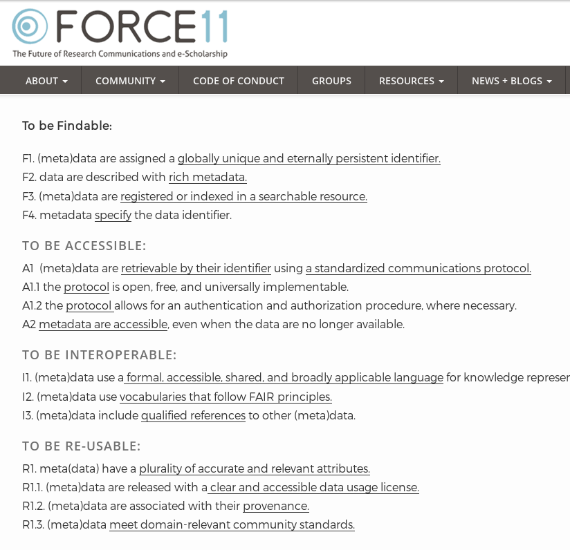

::::

:::

## The point of FAIR principles

::: {.columns-2}

:::: {.column}

"Good data management is not a goal in itself, but rather is the key conduit leading to knowledge discovery and innovation, and to subsequent data and knowledge integration and reuse by the community after the data publication process."

::::

:::: {.column}

"FAIR Principles put specific emphasis on enhancing the ability of machines to automatically find and use the data, in addition to supporting its reuse by individuals." 

([Wilkinson et al, 2016](https://doi.org/10.1038/sdata.2016.18))

::::

:::

# The Data Lifecycle

## The Data Lifecycle

::: {.columns-2}

:::: {.column}

- Amorphous thing... no clear consensus
- Might involve **destruction**
  - What is the value of data?
  - Who decides on the value of data?

::::

:::: {.column}

Industry-proposed data lifecycle: 

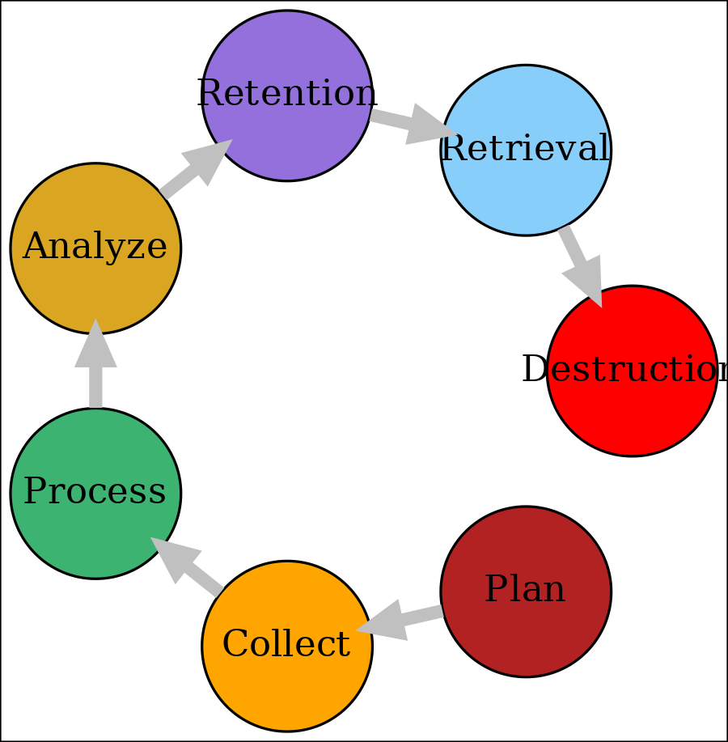

::::

:::

## The Data Lifecycle

::: {.columns-2}

:::: {.column}

- Amorphous thing... no clear consensus
- Might involve destruction
  - What is the value of data?
  - Who decides on the value of data?

::::

:::: {.column}

... which might really be a line

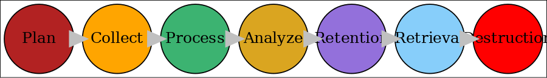

::::

:::

## The Data Lifecycle

::: {.columns-2}

:::: {.column}

- Amorphous thing... no clear consensus
- Might involve destruction
  - What is the value of data?
  - Who decides on the value of data?

::::

:::: {.column .center}

A difficult question

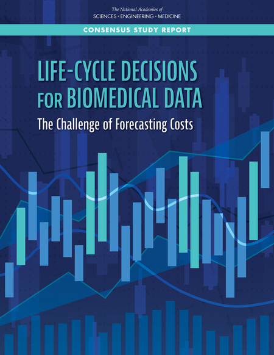
</center>

> National Academies of Sciences Engineering and Medicine}, Life-Cycle Decisions for Biomedical Data: The Challenge of Forecasting Costs, Washington, DC: The National Academies Press, 2020. [https://dx.doi.org/10.17226/25639](https://dx.doi.org/10.17226/25639)

::::

:::

## The Data Lifecycle

::: {.columns-2}

:::: {.column}

- Amorphous thing... no clear consensus
- Might involve destruction
- Might involve **re-use**

::::

:::: {.column}

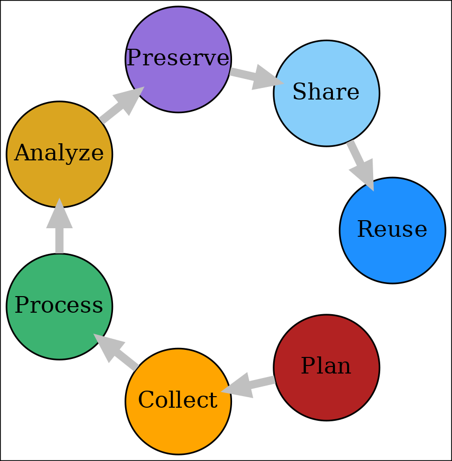

::::

:::

## The Data Lifecycle

::: {.columns-2}

:::: {.column}

- Amorphous thing... no clear consensus
- Might involve destruction
- Might involve **re-use**
  - which starts the cycle anew

::::

:::: {.column}

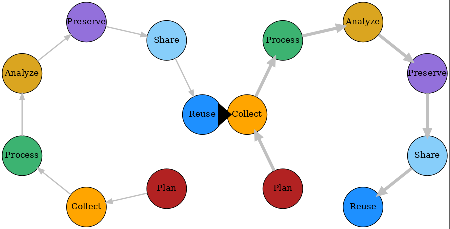

::::

:::

## Timing

::: {.columns-2}

:::: {.column}

Consider the following questions:

Once you have **collected** the data
- is it really going to change?

Once you have registered your analysis plan
- should the **processing and analysis** really change?

::::

:::: {.column}


::::

:::

## Modified Data and Workflow

::: {.columns-2}

:::: {.column}


Let's consider the preservation part separately:

::::

:::: {.column}

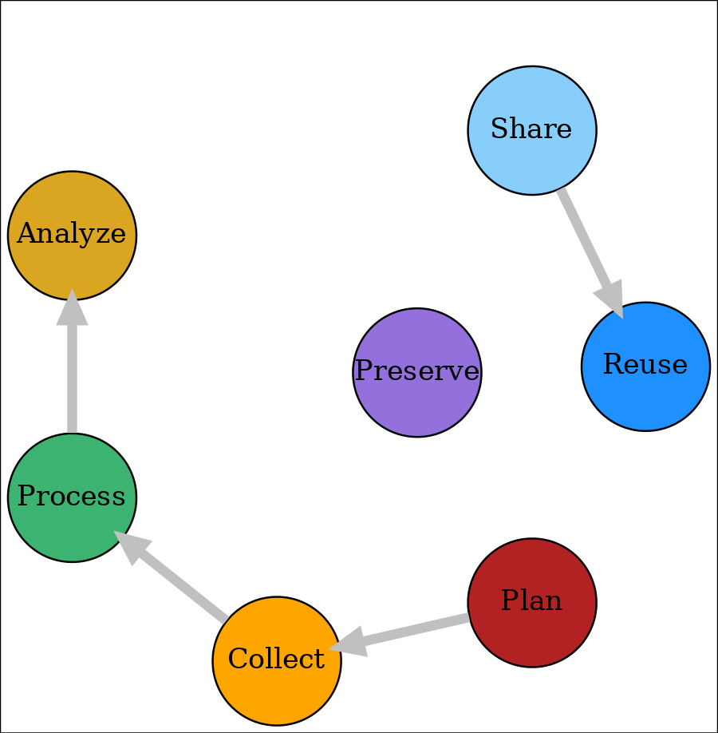

::::

:::


## Modified Data and Workflow

::: {.columns-2}

:::: {.column}

Preserve as you go

::::

:::: {.column}


::::

:::

## Note: Doubtful ethics of others...


<div style="text-align: center; font-size: 200%;">
I don't want to be scooped!
<br />
<br/>
Thus, I'm not going to publish my raw data just yet!
</div>


# What is preservation

## Preservation {.smaller}

::: {.columns-2}

:::: {.column}

- Preservation != publication, != sharing
- In fact, preservation may mean: not very accessible at all!
- Preservation is intended to maintain data for tens, even hundreds of years
  - Preservation may involve curation: active transformation of the data for improved accessibility
  
::::

:::: {.column}

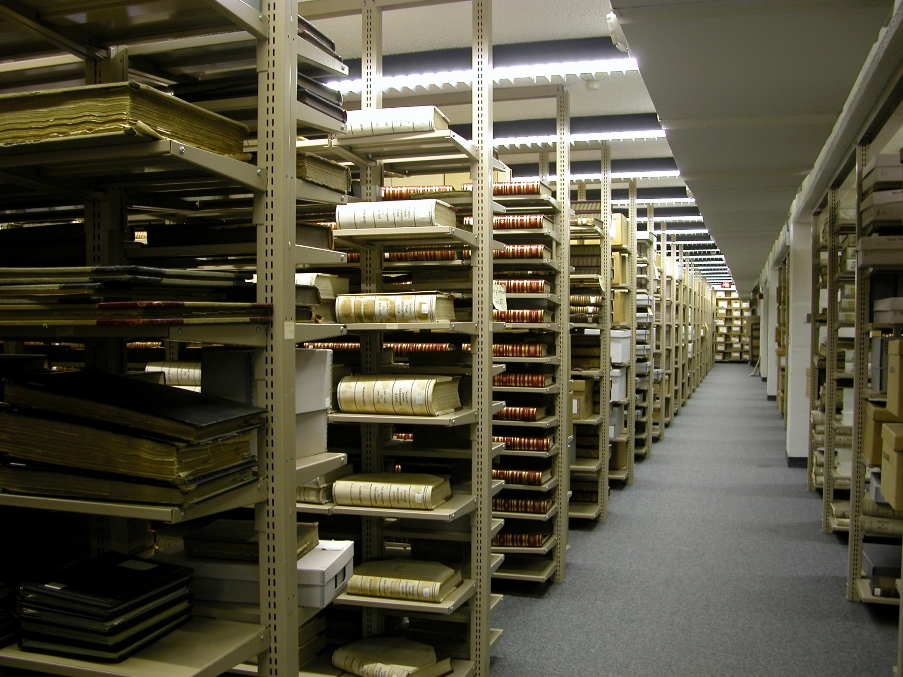

::::

:::
  
## What is publication


Publication typically involves making information about the data, as well as the data themselves, available to others.

- Publication can initially mean that only **metadata** (information about the data) is published
- In some cases, it may be that **only** metadata is ever published
- But the metadata will point to how to access the data, how long the data will be preserved, and other salient facts


## FAIR Principles {.smaller}

::: {.columns-2}

:::: {.column}

To be Findable:

- F1. **(meta)data are assigned a globally unique and eternally persistent identifier.**
- F2. data are described with rich metadata.
- F3. **(meta)data are registered or indexed in a searchable resource.**
- F4. metadata specify the data identifier.

::::

:::: {.column}

To be Accessible:

- A1 **(meta)data** are retrievable by their identifier using a standardized communications protocol.
- A2 metadata are accessible, even when the data are no longer available.

::::

:::

## FAIR Principles {.smaller}

::: {.columns-2}

:::: {.column}

To be Interoperable:

- I1. **(meta)data use a formal, accessible, shared, and broadly applicable language for knowledge representation.**
- I2. **(meta)data use vocabularies that follow FAIR principles.**
- I3. (meta)data include qualified references to other (meta)data.

::::

:::: {.column}

To be Re-usable:

- R1. meta(data) have a plurality of accurate and relevant attributes.
- R1.1. **(meta)data are released with a clear and accessible data usage license.**
- R1.2. **(meta)data are associated with their provenance.**
- R1.3. (meta)data meet domain-relevant community standards.

::::

:::


## FAIR Metadata when data are not shareable

::: {.columns-2}

:::: {.column}


IAB: [Establishment History Panel (BHP) - Version 7518 v1](https://doi.org/10.5164/IAB.BHP7518.de.en.v1) at [https://doi.org/10.5164/IAB.BHP7518.de.en.v1](https://doi.org/10.5164/IAB.BHP7518.de.en.v1)

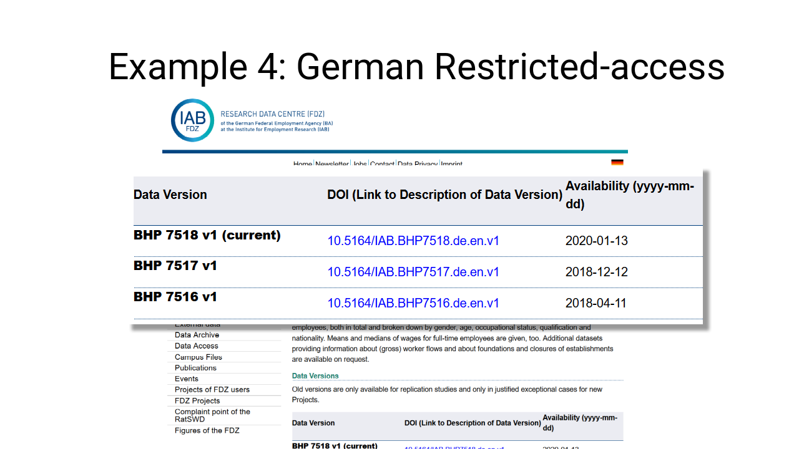

::::

:::: {.column}

Access conditions involve application process.

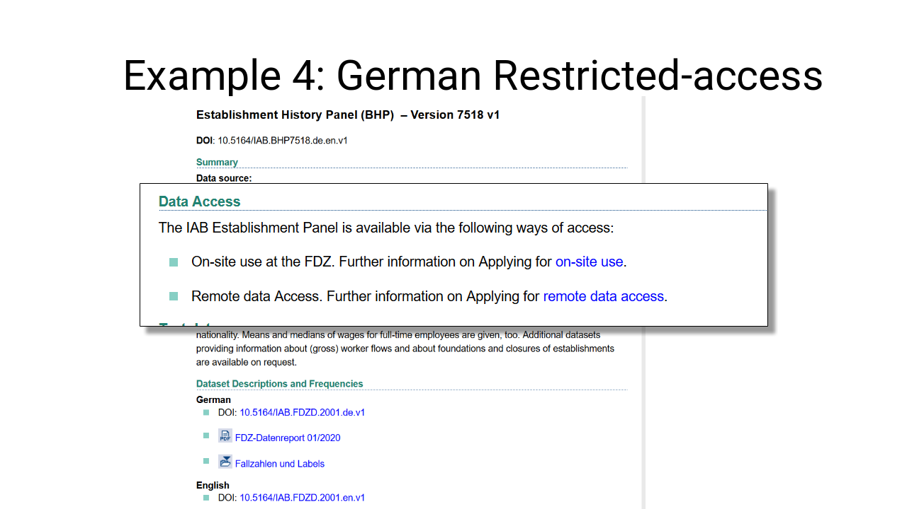

But information ABOUT the access process (=metadata) is available.

::::

:::

## What kind of access conditions? {.smaller}

::: {.columns-2}

:::: {.column}

In decreasing order of "freely available"

- Freely available (waive copyright)
- Attribution requested (e.g., citation): for instance, "CC-BY"
- **Available only to university researchers**
- **Available after embargo**

::::

:::: {.column}

- Available after application process handled by a data provider
  - Only checks for legal compliance
- Available with permission of the original researchers
  - Checks for why you use it
- Only available if you are called "Lars"

::::

:::


# This all seems so complicated

## This all seems so complicated

- I need to preserve my data for decades!
- I need to manage the application process for decades!
- Where do I get that DOI thing?
- How to I get Google to index my data?


# Let's start

<div style="text-align: center;">

</div>

## Imperfect example

- Original data
- Analysis data
- Analysis code
- Analysis output


## Options for Preservation (1)


**Trusted Repositories**

Journals and institutions have assessed a number of trusted repositories:
- [CoreTrustSeal](https://www.coretrustseal.org/) has a certification process
- [re3data.org](https://www.re3data.org/) lists research data repositories
- [Nature](https://www.nature.com/sdata/policies/repositories), [F1000Research](https://f1000research.com/for-authors/data-guidelines#hosting), and [PLOS](https://journals.plos.org/plosone/s/data-availability) have lists of trusted repositories. 
- Always check with your journal for specific restrictions or suggestions.

## Options for Preservation (2)

**Trusted Repositories**

- These generally include at least the following:
  -  [Dryad Digital Repository](http://datadryad.org/)
  -  [figshare](http://figshare.com/)
  -  [Harvard Dataverse](https://dataverse.harvard.edu)
  -  [ICPSR](https://www.icpsr.umich.edu/icpsrweb/) and [OPENICPSR](https://www.openicpsr.org/openicpsr/)
  -  [Open Science Framework](http://osf.io/)
  -  [Zenodo](http://zenodo.org/)
  - Country or region-specific repositories (that nevertheless generally accept depositors from anywhere): [GESIS](https://datorium.gesis.org/xmlui/) (Germany), [Swedish National Data Service (SND)](https://snd.gu.se/en/describe-and-deposit-data), [EASY](https://easy.dans.knaw.nl/ui/home) (Netherlands), [CSIRO](https://data.csiro.au/collections/) (Australia), etc.
- Many universities have formal document repositories that may be able to assume such a role; talk to your (data) librarian

## What are NOT options for preservation

::: {.columns-2}

:::: {.column}

- Github, Gitlab, Bitbucket, etc.
- Dropbox, Box.com, Google Drive, etc.
- Your personal website
- Your university's departmental website

::::

:::: {.column}

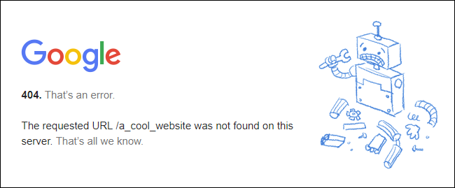

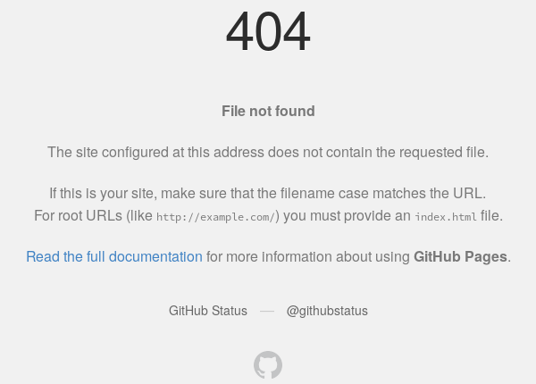

::::

:::

## Options for Preservation

::: {.columns-2}

:::: {.column}

Here: Sandbox for Zenodo

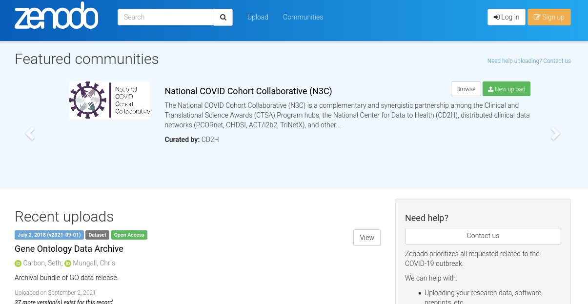

::::

:::: {.column}

In one of my day jobs:

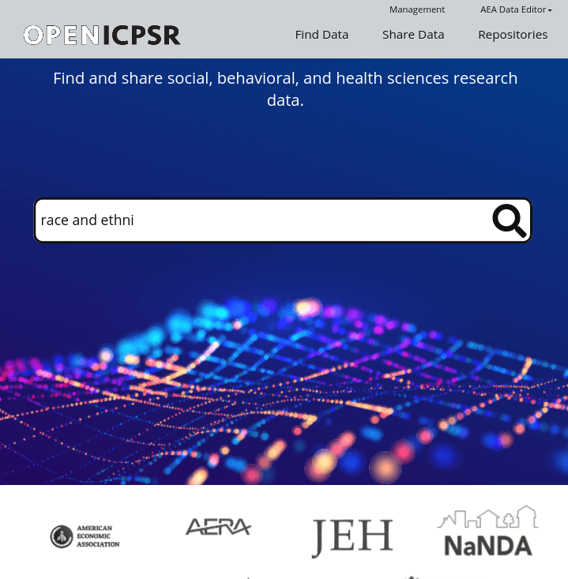

::::

:::

# Getting started on Zenodo

## Getting started on Zenodo

We will NOT use the regular Zenodo; rather, we will test in the Sandbox. 


**https://sandbox.zenodo.org/**


Check your URL bar! There's no other indication that this is not the real Zenodo!


## Getting started on Zenodo


Let's go to Zenodo:

> - Presenter: [https://sandbox.zenodo.org/deposit/1211247](https://sandbox.zenodo.org/deposit/1211247)
> - Viewers: [https://sandbox.zenodo.org/](https://sandbox.zenodo.org/)


# Do it now


```{r, child=c('counter30.md')}
```

# Next

```{r, child=c('toc2.md')}
```