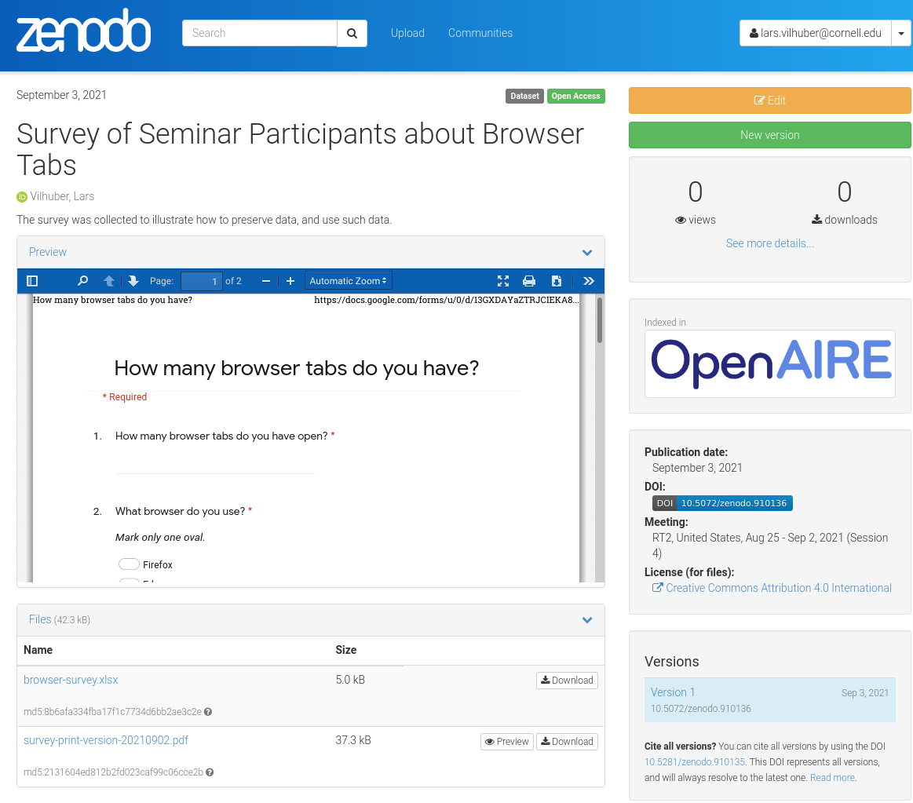
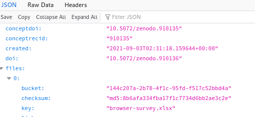
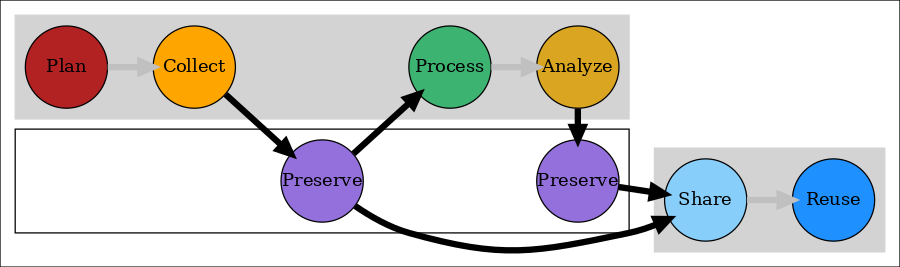

Data Sharing and Archiving for Reproducibility (RT2 2021): Part 2
========================================================
author: Lars Vilhuber
date: `r Sys.Date()`
autosize: true
width: 1200

Cornell University

```{r setup, echo=FALSE, include=FALSE, msg = FALSE, eval=TRUE}
# double-check: this should not install any libraries if running in Docker
source("global-libraries.R",echo=TRUE)
```

```{r, echo=FALSE}

# shortcuts
check <- emo::ji("heavy_check_mark")
```


Previously
==========


- Survey forms - `r check``r check`
- Metadata - `r check``r check`
- Sample data - `r check``r check`
- Actual data

***




Result
======


>  Goal 1: Be able to curate the data necessary for reproducible analysis

We have archived sample data and provenance information (survey form) in a reliable location. `r check`

> Goal 2: Know when to do so

We did so at the earliest possible moment. `r check`


Next step
=========
type: prompt


- Collect data
- Update archive

***


- Use preserved data
- Analyze data


Update the data
===========
type: section


```{r, include=FALSE}
# Image by <a href="https://pixabay.com/users/3D_Maennchen-1553824/?utm_source=link-attribution&amp;utm_medium=referral&amp;utm_campaign=image&amp;utm_content=1013732">Peggy und Marco Lachmann-Anke</a> from <a href="https://pixabay.com/?utm_source=link-attribution&amp;utm_medium=referral&amp;utm_campaign=image&amp;utm_content=1013732">Pixabay</a>
```


<div style="text-align: center;">

</div>

using the  [Google Sheet with updated Survey data](https://docs.google.com/spreadsheets/d/141okmmX_P8bLvZ_K1uA-yBicKqS9rBm8DgUXi2Sa6f0/edit?usp=sharing)


Publish the data
===========
type: section


```{r, include=FALSE}
# Image by <a href="https://pixabay.com/users/3D_Maennchen-1553824/?utm_source=link-attribution&amp;utm_medium=referral&amp;utm_campaign=image&amp;utm_content=1013732">Peggy und Marco Lachmann-Anke</a> from <a href="https://pixabay.com/?utm_source=link-attribution&amp;utm_medium=referral&amp;utm_campaign=image&amp;utm_content=1013732">Pixabay</a>
```


<div style="text-align: center;">

</div>

at the [Zenodo deposit https://sandbox.zenodo.org/record/910136](https://sandbox.zenodo.org/record/910136) (this one only works for the presenter)

Using the data
==============
type: section

<center>

</center>

Adding configuration information
===============================
We can now use the following information to augment the replication:

```{r}
# Zenodo DOI prefix for Sandbox
zenodo.prefix <- "10.5072/zenodo"
# Specific ID for my deposit - resolves to a latest version!
zenodo.id <- "910135"
# We will recover the rest from Zenodo API
zenodo.api = "https://sandbox.zenodo.org/api/records/"
```


(Behind the scenes)
==================
We will parse the information that Zenodo gives us through an API:

> `r paste0(zenodo.api,zenodo.id)`

<div style="text-align: center;">

</div>


Automating the data acquisition
==========================

```{r, eval=FALSE}
# needs rjson, tidyr, dplyr
```
We download the metadata from the API (to see what this looked like **before** we made any changes, see [this version in the Github repository](https://github.com/labordynamicsinstitute/tutorial-data-sharing-archiving-2021/blob/d3714700ce7e1758ac75d0ac07b730e421935333/data/metadata.json))
```{r, eval=TRUE}
download.file(paste0(zenodo.api,zenodo.id),destfile=file.path(dataloc,"metadata.json"))
```
We read the JSON in:
```{r, eval=TRUE}
latest <- fromJSON(file=file.path(dataloc,"metadata.json"))
```
We get the links to the actual XLSX files (and the Survey):
```{r, eval=TRUE}
file.list <- as.data.frame(latest$files) %>% select(starts_with("self")) %>% gather()
```


Automating the data acquisition
==========================

We download all the xlsx files, by looking whether the filename has `xlsx` in it:
```{r, eval=TRUE}
for ( value in file.list$value ) {
	print(value)
	if ( grepl("xlsx",value ) ) {
	    print("Downloading...")
	    file.name <- basename(value)
	    download.file(value,destfile=file.path(workpath,basename(value)))
	} else {
	  print("Skipping.")
	}
}
```


Re-use of our own archive
=================================

Now that we have downloaded our own archival version of the survey, we can use it:

```{r}
browser_survey <- read_excel(file.path(workpath,"browser-survey.xlsx"))
```

We should also preserve WHICH version we are actually using:

```{r}
# The deposit ID always points to the latest version, but we want to identify which version that is:
latest.doi <- latest$doi
latest.doi
```

Crosstab
========

```{r}
browser_survey %>% 
  mutate(num_tabs = as.numeric(`How many browser tabs do you have open?`)) %>%
  group_by(`What browser do you use?`) %>%
  summarize(`Mean number of tabs` = mean(num_tabs,na.rm=TRUE)) -> table

```


Result
======
type: prompt


***

<center>
```{r, echo=FALSE}
table %>% 
  kable(caption=paste0("Browser tabs by browser type."))
```

 Source: `r paste0("https://doi.org/",latest$doi)`,<br/>
 created `r latest$created`.
 
 Note: DOI is fake. 
</center>

Lessons learned
===============



- Goal 1: Be able to curate the data necessary for reproducible analysis `r check`
- Goal 2: Know when to do so `r check`
- Goal 3: Choose license (while respecting ethics)

***

 

or [latest!](https://doi.org/10.5072/zenodo.910135)


Next steps
==========
- [Making your research re-usable - licenses](index3.html)
- [Archiving your research code](index4.html)


Conclusion
==========


Thank you
==========
type: section

Presentation: https://labordynamicsinstitute.github.io/tutorial-data-sharing-archiving-2021

Source: https://github.com/labordynamicsinstitute/tutorial-data-sharing-archiving-2021
